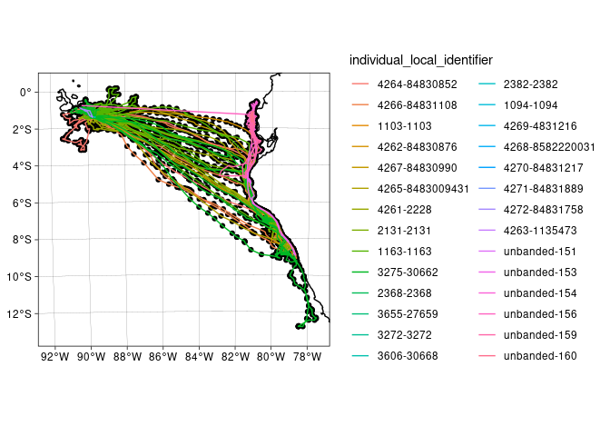

<!-- README.md is generated from README.Rmd. Please edit that file -->

# move2

<!-- badges: start -->

[](https://gitlab.com/bartk/move2/-/pipelines/main/latest)
[](https://gitlab.com/bartk/move2/-/graphs/main/charts)
[](https://CRAN.R-project.org/package=move2)
[](https://lifecycle.r-lib.org/articles/stages.html#stable)
<!-- badges: end -->

The goal of the `move2` package is to facilitate handling movement data
by creating the `move2` class that extents the functionality of the `sf`
package. It facilitates import of animal movement data from
[movebank](https://www.movebank.org/cms/webapp?gwt_fragment=page%3Dsearch_map).
The `move2` package is designed as a successor to the `move` package,
but improves in speed and functionality by being redesigned from the
ground up. More documentation can be found on the
[website](https://bartk.gitlab.io/move2/).

## Installation

You can install the development version of move2 like so:

``` r
devtools::install_git('https://gitlab.com/bartk/move2.git')
```

## Example

By using units it is possible to track changes through analysis, note
that ggplot directly has the correct units on the y axis

``` r
require(units)
require(dplyr)
require(ggplot2)
require(move2)
require(rnaturalearth)
track <- mt_read("~/Downloads/Galapagos Albatrosses.csv")
track
#> A <move2> object containing 28 tracks consisting of:
#> Simple feature collection with 16414 features and 18 fields
#> Geometry type: POINT
#> Dimension:     XY
#> Bounding box:  xmin: -91.3732 ymin: -12.79464 xmax: -77.51874 ymax: 0.1821983
#> Geodetic CRS:  WGS 84
#> # A tibble: 16,414 × 19
#>   `event-id` visible timestamp           `eobs:battery-voltage`
#> *    <int64> <lgl>   <dttm>                                [mV]
#> 1   28192544 TRUE    2008-05-31 16:29:31                   3719
#> 2   28192529 TRUE    2008-05-31 16:30:04                   3652
#> 3   28192530 TRUE    2008-05-31 18:00:29                   3713
#> 4   28192531 TRUE    2008-05-31 19:30:49                   3720
#> # ℹ 16,410 more rows
#> # ℹ 15 more variables: `eobs:fix-battery-voltage` [mV],
#> #   `eobs:horizontal-accuracy-estimate` [m], `eobs:key-bin-checksum` <int64>,
#> #   `eobs:speed-accuracy-estimate` [m/s], `eobs:start-timestamp` <dttm>,
#> #   `eobs:status` <ord>, `eobs:temperature` [°C], `eobs:type-of-fix` <fct>,
#> #   `eobs:used-time-to-get-fix` [s], `ground-speed` [m/s], heading [°],
#> #   `height-above-ellipsoid` [m], `sensor-type` <fct>, …
#> First 4 track features:
#>   individual-taxon-canonical-name            study-name tag-local-identifier
#> 1            Phoebastria irrorata Galapagos Albatrosses                  138
#> 2            Phoebastria irrorata Galapagos Albatrosses                  152
#> 3            Phoebastria irrorata Galapagos Albatrosses                  134
#> 4            Phoebastria irrorata Galapagos Albatrosses                  140
#>   individual-local-identifier
#> 1                4269-4831216
#> 2               4267-84830990
#> 3               4266-84831108
#> 4             4268-8582220031
ggplot() +
  geom_sf(data = ne_coastline(returnclass = "sf", 10)) +
  theme_linedraw() +
  geom_sf(data = track) +
  geom_sf(data = mt_track_lines(track), aes(color = `individual-local-identifier`)) +
  coord_sf(
    crs = sf::st_crs("+proj=aeqd +lon_0=-83 +lat_0=-6 +units=km"),
    xlim = c(-1000, 600),
    ylim = c(-800, 700)
  )
#> In total 386 empty location records are removed before summarizing.
#> Joining with `by = join_by(`individual-local-identifier`)`
```



``` r
track %>%
  ggplot() +
  geom_point(aes(
    x = `eobs:used-time-to-get-fix`,
    y = (`eobs:battery-voltage` - `eobs:fix-battery-voltage`) / `eobs:used-time-to-get-fix`
  )) +
  xlab("Time to fix") +
  ylab("Voltage drop rate")
```


## Other packages

Several other packages exist for dealing with movement data. For an
overview see the CRAN [task
view](https://cran.r-project.org/view=Tracking). Here we make a quick
comparison to some other packages that define movement datasets and the
differences to `move2`:

-   `move`: The `move` package is based on `sp` and therefore the `S4`
    classes. This class system is very capable but it sometimes results
    in the data being more difficult to handle. Furthermore as `sf`
    improves on `sp` `move2` will be able to improve in speed.
-   `sftrack`: Does not include trajectory information. Furthermore the
    `sft_group` attribute is quite large (in memory due to being a
    character) and relatively slow.
-   `amt`/`trajr`/`ctmm`: These do not extend a spatial class meaning
    other spatial functions do not work on these trajectories.
    Furthermore these objects do not keep track of trajectory level
    information (e.g. sex, data of birth & capture location).

Compared to the other packages `move2` tries to be flexible enough that
it is easy to use in other software but still retains the formal
properties and all meta data of trajectories. Therefore we avoid more
complicated data structures (e.g. [Kranstauber *et al*,
2011](https://doi.org/10.1016/j.envsoft.2010.12.005)).

## Future

Currently the `move2` package focuses on core functionality, ideas for
additional packages exist:

-   `moveAcc`/`moveIMU`: probably using `vctrs`/`pillar` for storing
    bursts of acceleration or orientation data.
-   `moveUd`: for example Brownian bridges
-   `moveSim`: for simulation trajectories
-   `moveShiny`: for simple quick apps using shiny modules for
    visualizing and exploring trajectories

### Additional functionality in `move2`

There are ideas for additional functionality they are not directly
implemented but recorded here to keep them on the radar. Specific
suggestions or information what is used are welcome.

-   Filter functions we might want to implement:
    -   `filter_duplicate_locations_minimal_travel`
    -   `filter_minimal_travel`: Minimally x meter travel between
        locations
    -   `filter_minimal_distance`: Minimally x meter distance between
        locations
    -   `filter_outlier_quick_return`: Combination of \~180 degree
        turns, high speed and comparable distances?
-   Import data from the movebank data repository
-   Import data from PostgreSQL database

## Development

By installing the package `todor` it is possible to find all to-dos as
markers through the `rstudio` addins menu, or run
`todor::todor_package_addin()`. Furthermore we use `precommit` to
validate code before committing. Testing is done through `testthat`.

## Dependencies

``` r
depgraph::plot_dependency_graph(".", suggests = FALSE)
```


